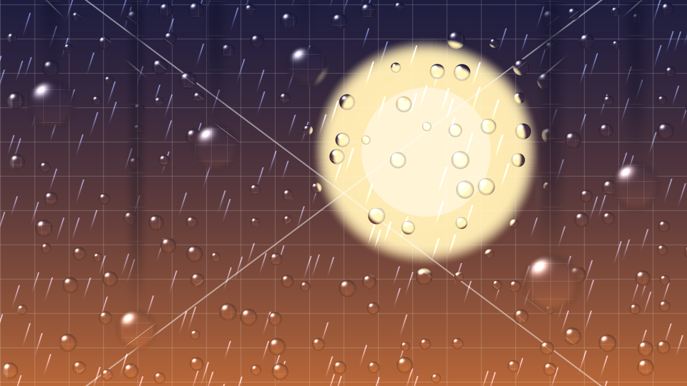

# cozy

Animated rain over your Wayland wallpaper.

cozy is a `wlr-layer-shell` client that sits on the **background** layer, renders your wallpaper itself, and composites two rain effects on top of it in a single fragment shader: additive falling **streaks**, and glass **droplets** that refract the wallpaper behind them. Clicks fall straight through to the desktop.



<br>

## Requirements

- A Wayland compositor that implements `wlr-layer-shell` (Hyprland, sway, river, …).

- Mesa / EGL with OpenGL ES 3.0 (software rendering via llvmpipe is fine).

- Rust (stable) and the usual Wayland/EGL development headers.

<br>

## Build & run

```sh
cargo build --release
./target/release/cozy
```

cozy binds one background surface per output and starts drawing immediately. A test wallpaper is embedded, so it renders out of the box.

Stop it with `Ctrl-C` (or `kill`); the layer surfaces and GL contexts are torn down on exit.

> **Note:** cozy is Linux/Wayland only. On other platforms, develop and test it through the container harness below.

<br>

## Configuration

A TOML config file (`cozy.toml`) is planned and will expose the tunables below. Until then these are baked-in defaults; the rain parameters live as named constants at the top of each stage in `shaders/rain.frag`.

| Knob | Meaning |
|---|---|
| `wallpaper_path` | Image to render as the background. |
| `streak_density` | How many rain streaks. |
| `droplet_density` | How many glass droplets. |
| `wind` | Horizontal skew shared by all effects. |
| `refraction_strength` | How strongly droplets bend the wallpaper. |
| `tint` | Streak color. |
| `fps_cap` | Upper bound on redraw rate. |

<br>

## How verification works

The dev machine here is macOS, but cozy is Linux-only — so it is built and **visually verified inside a Linux container**.

The harness runs a headless [sway](https://swaywm.org/) compositor with Mesa's software renderer, launches cozy against it, and captures screenshots with [grim](https://sr.ht/~emersion/grim/) into `./out/`.

```sh
make verify          # build image, run cozy under headless sway, capture frames
make verify ARGS=…   # pass extra args to the cozy binary
make lint            # rustfmt --check + clippy -D warnings
make shell           # drop into the container to poke around
```

Each milestone is confirmed by reading the captured PNGs: a solid clear color (EGL works), the wallpaper (texture + cover-fit), then streaks and droplets that move between frames.

<br>

## Architecture

One layer surface per output, each owning its own EGL/GLES context and renderer. cozy draws the wallpaper as the **opaque** base and composites the rain inside the shader — so there is no compositor-level transparency to fight.

```
src/
  main.rs            bootstrap: connect, bind globals, run the event loop
  app.rs             app state + all Wayland event handlers
  surface.rs         one background layer surface per output, + its drawing
  render/
    egl.rs           EGL display/context setup on a Wayland surface
    gl.rs            shader program, fullscreen-triangle draw, uniforms
    texture.rs       decode an image → RGBA8 GL texture
shaders/
  rain.vert          fullscreen triangle
  rain.frag          the effects: base → streaks → droplets → refraction
```

The fragment shader is staged so effects stay independent — each is a self-contained function (`streaks`, `static_droplets`, `sliding_droplets`, `refracted_base`) composited in `main`, making a new effect cheap to add.

<br>

## License

MIT
